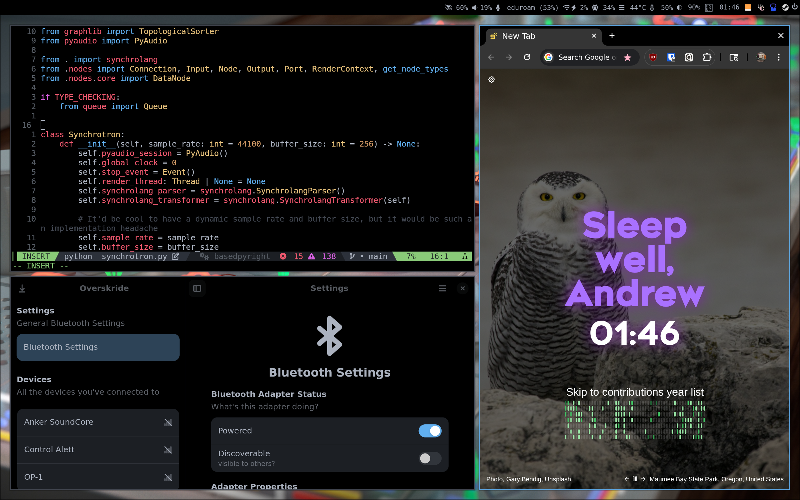

# My NixOS configuration

Here lie the [NixOS](https://nixos.org/) configuration files I use for my system setup (currently just my [Framework 16](https://frame.work/products/laptop16-diy-amd-7040) laptop). It's rather janky and _probably_ will break on differing hardware, but hey - it's mine.



## Okay, so what's special about it?

I'm glad you asked. There is actually one special feature within this jankfest which I think is somewhat unique, in a way which every major OS / desktop environmnent already does *in theory* but none actually does a good job in practice at.

### The backup problem

Usually, on a computer system, your documents and personal files lie scattered amongst the rest of the system, configuration, cache, and app data files. Some of these are important but not *to you directly* (i.e. they aren't "your documents"), and some of these can be harmlessly deleted and you wouldn't bat an eye.

**This really, *really* sucks for backups.**

You're essentially left with two options:
1. Hunt down the paths where your personal files are and select them for backup - which is tedious, risky, and [the Tao of Backup is unhappy](http://www.taobackup.com/coverage.html).
2. Back up *everything* - which is a huge waste of space, and consequently money.

(Of course, what people often do is back up just their home directory, which is sort of the worst of both worlds - it brings all sorts of extra clutter and *still* isn't reproducible!)

Currently, way, *way* too many people don't back up their files, and this dilemma certainly isn't helping the situation.

So, what else can we do?

### #notlikeotherputers

Instead of chasing our documents across the filesystem, how about we keep them all in one place? Just pop 'em in a single directory?

...wait, that's it?

...also, doesn't Every Computer System™️ already do that?

Not really. The user home directory was *sort of* meant to accomplish that, but it's heavily polluted by all sorts of junk from all sorts of programs. The Documents directory is better in that regard, but it's not standardised and usually isn't integrated with your programs - you have to manually open and save files to and from it.

This NixOS configuration aims to solve this by employing any dirty tricks necessary (usually symlinks) to *force* programs into writing all their meaningful user data into a single `data/` directory inside your home directory.

**That's it. That's all your files. That's all you have to back up.**

An opinionated set of links is constructed between the system and the `data/` directory, meaning you don't have to worry about external app data paths. This also effectively maps your data back into the system, meaning the `data/` directory is fully portable and can e.g. be hot-swapped with a backup, or mounted from a USB drive.

Finally, take control of your files!!!

## Installation

> [!NOTE]
> These instructions will only work on a NixOS machine. An internet connection is necessary, and a fast one is strongly preferable.

First, clone the repository to a sensible location (e.g. `~/nixos`):
```bash
git clone https://github.com/ThatOtherAndrew/NixOS ~/nixos
```

Next, edit the `variables.nix` file to configure individual settings (e.g. your username and email).

Then, use the `nixos-generate-config` command to tailor the configuration to your specific computer hardware:
```bash
nixos-generate-config --show-hardware-config > ~/nixos/hosts/nova/hardware-configuration.nix
```

Finally, run the rebuild command!
```bash
sudo nixos-rebuild switch --flake ~/nixos
```

And there you go, that's it! NixOS handles the rest for you from here, like magic~

> [!NOTE]
> Currently, this configuration does not automatically launch a specific graphical environment upon boot. Use the command `uwsm start hyprland-uwsm.desktop` to start the Hyprland desktop environment shown in the screenshot.
